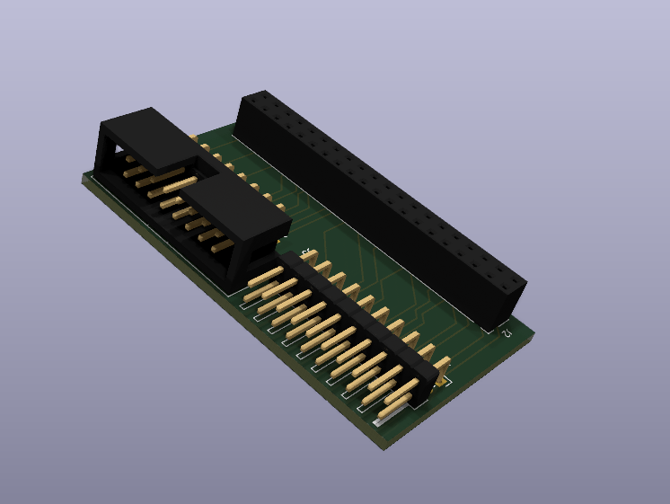

# Raspberry Pi 4 40 Pin GPIO to HUB75 Adapter Board

This PCB converts pins 23-40 of the Pi GPIO to the HUB75 header. The remaining pins 1-22 are mapped to the 20-pin header on the board. It is intended this is used with the [RGB LED Matrix](https://github.com/hzeller/rpi-rgb-led-matrix/tree/master) library with a custom mapping [(here)](https://github.com/mura3277/rpi-rgb-led-matrix/blob/master/lib/hardware-mapping.c#L29) as this adapter accesses different GPIO from the regular pin mapping. The mapping is as follows:

|Row 1        | Row 2       |
|-------------|:-----------:|
|GPIO 8 (G1)  |GPIO 11 (R1) |
|GND          |GPIO 0 (B1)  |
|GPIO 7 (G2)  |GPIO 5 (R2)  |
|GPIO 1 (E)   |GPIO 6 (B2)  |
|GPIO 12 (B)  |GPIO 13 (A)  |
|GPIO 16 (D)  |GPIO 19 (C)  |
|GPIO 20 (STB)|GPIO 26 (CLK)|
|GND          |GPIO 21 (OE-)|

Pin mapping for the remaining 20 pins from the Pi GPIO:

|Row 1     | Row 2    |
|----------|:--------:|
|3v3 Power |5v Power  |
|GPIO 4    |GND       |
|GPIO 2 I2C|GPIO 3 I2C|
|GPIO 15   |GPIO 14   |
|GPIO 18   |GPIO 17   |
|GPIO GND  |GPIO 27   |
|GPIO 23   |GPIO 22   |
|GPIO 24   |GPIO 10   |
|GND       |GPIO 9    |
|GPIO 25   |GND       |

