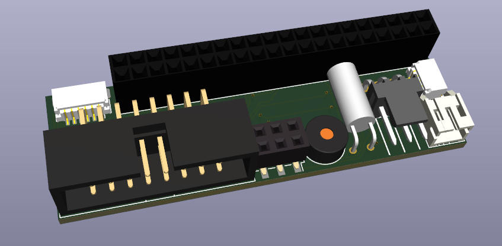

# Raspberry Pi 40 Pin GPIO to HUB75 Adapter Board

This PCB maps the Pi GPIO to the HUB75 header. The remaining pins are mapped to a 8-pin header to connect additional devices. It is intended this is used with the [RGB LED Matrix](https://github.com/hzeller/rpi-rgb-led-matrix/tree/master) library.

Pin mapping for the remaining pins from the Pi GPIO:
|Col 1     | Col 2    |
|----------|----------|
|GPIO 6    |GPIO 13   |
|5v Power  |GPIO 19   |
|GND       |GPIO 26   |

Pin mapping for IO header for the future input PCB:
|Col 1     | Col 2    |
|----------|----------|
|GPIO 12   |GPIO 1    |
|GPIO 20   |GPIO 16   |
|GND       |GPIO 21   |

# Change Log
## 7.0
-  Added 2 pin power header.
-  Added 4 pin STEMMA QT connector.
-  Changed the 6 pin IO to a smaller JST SH.
-  Changed the 6 pin GPIO to a low profile pin socket.
-  Adjusted layout to support RPi5 with 5-6mm heatsink

## 6.0
-  Went back to the regular HUB75 mapping as outlined by the rpi-rgb-led-matrix repo.
-  Dropped some pins from the GPIO passthrough (extra GND, 3.3v).

## 5.0
-  Added a right angled tilt sensor to the board, connected to a GPIO pin.

## 4.0
-  Added buzzer to the board connected to a GPIO pin.
-  Split off the dedicated input pins to a 6 pin IDC so it can easily be connected to a daughter board.

## 3.0
-  Added 3 pin fan header connected to a GPIO pin for cooling a pi within an enclosure.

## 2.0
-  Added solder jumper pads to support displays with or without the extra data line E.

## 1.0
- Initial Version.